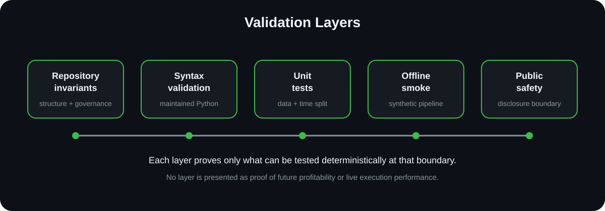

# TradingView AI Market-Analysis Automation — Case Study

> **PUBLIC SHOWCASE · SANITIZED · PORTFOLIO-SAFE**
>
> This repository is a public engineering proof artifact. It contains **no client identity, no confidential implementation source, no private datasets, no serialized private models, no credentials, no account details, no commercial terms, and no private conversations**.


## What this repository is

An anonymized engineering case study for a Python-based intraday market-analysis workflow covering historical OHLCV preparation, feature engineering, chronological model validation, zone/regime research, execution-oriented analysis, and repository hardening.

The engagement accumulated notebook-driven research and generated artifacts over multiple milestones. The engineering objective was to convert that research process into a disciplined validation pattern without turning historical model output into unsupported live-trading claims.

## Public vs. private repository boundary

| Area | This public showcase | Confidential delivery repository |
|---|---|---|
| Visibility | **Public** | **Private** |
| Purpose | Portfolio, proposals, capability proof | Engineering source of truth |
| Implementation notebooks/source | **Not included** | Controlled/private |
| Raw or licensed datasets | **Not included** | Controlled/private |
| Serialized delivery models | **Not included** | Controlled/private |
| Client identity / conversations | **Not included** | Controlled/private |
| Safe to share publicly | **Yes** | **No** |

This repository is not a fork, mirror, or source-code export. It has independent Git history and contains only sanitized documentation and diagrams.

## Challenge

- Normalize intraday OHLCV inputs before downstream research.
- Keep temporal train/test boundaries explicit to reduce leakage risk.
- Move reusable validation logic out of ad-hoc notebook state.
- Separate model research from zone/regime and execution-oriented analysis.
- Distinguish generated evidence from maintained engineering source.
- Prevent market-data/API credentials and machine-specific paths from entering maintained code.
- Create a portfolio-safe explanation without copying confidential implementation details.

## Engineering approach

```text
Historical OHLCV
      ↓
Schema / timestamp / price validation
      ↓
Feature engineering
      ↓
Chronological train/test separation
      ↓
Classification research
      ↓
Zone / regime analysis
      ↓
Execution-oriented validation
      ↓
Governed evidence + handover
```

## Engineering highlights

- **Temporal validation:** chronological out-of-sample separation rather than relying on random-only splits.
- **Data contracts:** explicit checks for OHLC consistency, timestamps, required columns, ordering, and missing values.
- **Feature discipline:** momentum, volatility, relative-volume, and price-structure families are treated as reproducible transformations rather than notebook-only state.
- **Model boundary:** classification metrics are evidence about a historical validation setup, not a promise of future trading performance.
- **Research separation:** zone/regime analysis is kept conceptually separate from the classifier so each layer can be reviewed independently.
- **Repository hardening:** secret-bearing and environment-specific research surfaces were removed from maintained source and future credentials are environment-injected.
- **Offline validation:** deterministic tests and a synthetic-data smoke path make core validation possible without network access or private data.

## Validation evidence



The maintained private engineering baseline was validated through repository invariants, Python syntax checks, unit tests for market-data and temporal-boundary rules, and an offline synthetic-data smoke pipeline. This public repository independently validates its own **disclosure boundary** and required showcase artifacts.

> Public CI does not contain or run the confidential implementation and does not reproduce private historical trading results.

## Technology

`Python` · `pandas` · `NumPy` · `scikit-learn` · `OHLCV validation` · `chronological model validation` · `TradingView-oriented research` · `GitHub Actions`

## What is intentionally not claimed

This showcase does **not** claim:

- guaranteed profitability, alpha, ROI, win rate, or loss prevention;
- live broker execution equivalence;
- future performance from historical classification metrics;
- that private market data can be redistributed publicly;
- that this public repository reproduces the confidential implementation;
- that TradingView alert delivery or brokerage automation is validated here.

## Full case study

[**Read the full public case study**](case-study.md)

Additional public-safe detail:

- [Technical overview](docs/technical-overview.md)
- [Validation evidence](docs/validation-evidence.md)
- [Disclosure boundary](docs/disclosure-boundary.md)
- [Standardization acceptance](docs/standardization-acceptance.md)

## Disclosure boundary

Only sanitized architecture, methodology, validation approach, repository-hardening practices, and engineering lessons are published here. Confidential implementation source, raw datasets, private model artifacts, client information, credentials, private infrastructure, and private repository history are intentionally excluded.
