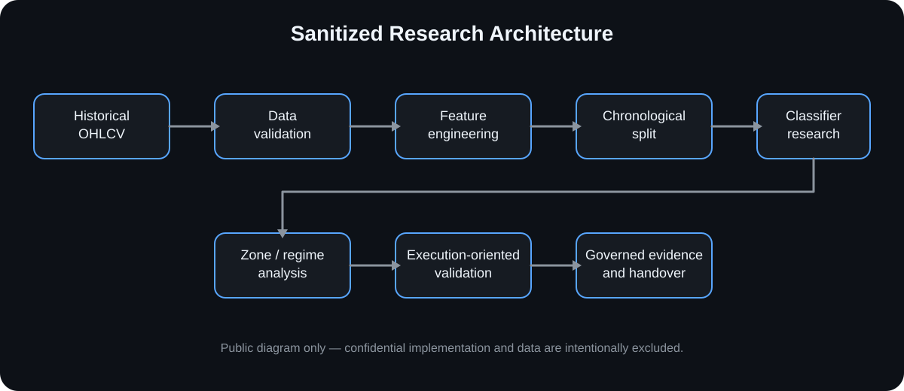

# TradingView AI Market-Analysis Automation — Case Study

> **OSYSTIC ENGINEERING CASE STUDY · PUBLIC SHOWCASE · SANITIZED · PORTFOLIO-SAFE**
>
> Prepared under the **OSYSTIC public engineering showcase standard** for client, partner, technical-review, and portfolio use. This repository contains **no client identity, no confidential implementation source, no private datasets, no serialized private models, no credentials, no account details, no commercial terms, and no private conversations**.



## Company showcase classification

| Attribute | Public classification |
|---|---|
| Publisher | **OSYSTIC** |
| Artifact type | Engineering case study / capability proof |
| Source engagement | Closed research engagement |
| Publication model | Sanitized public showcase with independent Git history |
| Confidential implementation | Excluded and retained privately |
| Production-trading claim | None |
| Intended use | Portfolio, proposals, technical due diligence, capability review |

This case study is designed to demonstrate engineering judgment, validation discipline, research governance, and responsible disclosure rather than to function as a downloadable client-delivery package.

## What this repository is

An anonymized case study of a small-cap intraday market-analysis engagement that evolved from a statistically grounded TradingView resistance/rejection indicator into a broader research framework for dynamic universe construction, point-in-time features, structural zones, path-dependent outcomes, execution-aware evaluation, and early regime analysis.

The strongest engineering lesson was that model sophistication is not enough: the universe, timestamps, labels, normalization, execution assumptions, evidence provenance, and research/production boundary all have to survive independent review.

## Engagement outcome

The initial indicator stage was completed and accepted, including a practical signal-state fix that required current zone interaction and a wick-aware interaction refinement.

The later research stage expanded substantially. It rebuilt the market universe dynamically, tightened point-in-time data construction, explored PMH and deterministic FIBO-style exhaustion structures, introduced path-dependent forward labeling, and separated raw statistical movement from constrained execution-oriented evaluation.

The final research package was **not promoted to production**. An independent methodological review identified additional stabilization work around possible leakage in part of the EV methodology, normalization consistency, and interpretation of some zone/regime relationships. The engagement was therefore closed at a research-validation milestone rather than turning exploratory evidence into an unsupported production-trading claim.

## Post-closure evidence governance

A later repository audit re-examined recovered delivery artifacts against the project timeline and the final research state. The private engineering archive applied a significant-only retention policy rather than copying every historical attachment back into the maintained tree.

That review used:

- content hashing to identify exact duplicates;
- chronology and supersession checks to distinguish later authoritative artifacts from earlier revisions;
- size and generated-data controls to keep bulk research exports out of maintained Git;
- secret scanning and quarantine rules for legacy source containing embedded access material;
- selective retention of the later chart-runtime source and compact final-research evidence in the private repository;
- an explicit rule that **no recovered private artifact is imported into this public showcase**.

This public repository records the engineering and governance lessons from that audit without exposing private filenames, source code, datasets, commercial documents, hashes, or credentials. See [Repository hardening & artifact recovery](docs/repository-hardening.md).

## Public vs. private repository boundary

| Area | This public showcase | Confidential engineering repository |
|---|---|---|
| Visibility | **Public** | **Private** |
| Purpose | Portfolio, proposals, capability proof | Retained engineering source/history |
| Implementation notebooks/source | **Not included** | Controlled/private |
| Raw or licensed datasets | **Not included** | Controlled/private/history |
| Serialized delivery models | **Not included** | Controlled/private/history |
| Client identity / conversations | **Not included** | Controlled/private |
| Commercial information | **Not included** | Controlled/private |
| Recovered delivery artifacts | **Not included** | Deduplicated/significant-only retention |
| Safe to share publicly | **Yes** | **No** |

This repository is not a fork, mirror, or source-code export. It has **independent Git history** and contains only sanitized documentation and diagrams.

## Research architecture

```text
Dynamic / historical OHLCV universe
              ↓
Point-in-time data validation
              ↓
Momentum / liquidity feature engineering
              ↓
Structural zone construction
              ↓
Path-dependent event outcomes
              ↓
Chronological model validation
              ↓
Continuation vs rejection analysis
              ↓
Execution approximation / outlier checks
              ↓
Regime-oriented research
              ↓
Evidence + explicit limitation boundary
              ↓
Post-closure artifact/provenance audit
```

## Engineering highlights

- **Representative-universe correction:** the workflow moved from a narrow symbol set toward day-by-day momentum-universe reconstruction.
- **Point-in-time discipline:** event price, ATR context, VWAP, and time-normalized relative volume were reviewed against what was knowable at the interaction timestamp.
- **Structure-aware zones:** Premarket High remained a primary liquidity level while later work tested a deterministic exhaustion/retracement zone with explicit anchoring/activation rules.
- **Path-dependent labels:** outcomes were evaluated by threshold order and paired with MFE/MAE and time-to-event measures rather than relying only on static direction labels.
- **Execution boundary:** raw excursion/EV findings were separated from constrained TP/SL-style approximation and outlier sensitivity.
- **Regime awareness:** large behavioral differences across liquidity/momentum groups motivated conditional analysis rather than one global average.
- **Research integrity:** unresolved methodology was documented as a limitation instead of being marketed as production alpha.
- **Artifact provenance:** recovered delivery material was deduplicated, evaluated for supersession and security risk, and retained privately only when it remained significant.
- **Repository hardening:** secret-bearing and machine-specific research surfaces were kept out of maintained source; public material remains independently sanitized.

## Technology

`Python` · `pandas` · `NumPy` · `scikit-learn` · `OHLCV validation` · `time-series validation` · `TradingView / Pine research` · `GitHub Actions`

## Capability keywords

`tradingview` · `pine-script` · `quantitative-research` · `market-analysis` · `time-series` · `machine-learning` · `model-validation` · `data-governance` · `research-engineering` · `github-actions`

## Validation boundary

The private engineering archive contains the confidential research history and controlled implementation material. The public repository validates only its disclosure-safe documentation boundary.

> This showcase does not reproduce confidential historical results and does not independently validate live trading performance.

## What is intentionally not claimed

This showcase does **not** claim:

- guaranteed profitability, alpha, ROI, win rate, or loss prevention;
- production trading readiness;
- live broker execution equivalence;
- that every historical research output survived later methodology review;
- future performance from historical classification metrics;
- redistribution rights for private/licensed market data;
- that this public repository reproduces the confidential implementation;
- that TradingView alert delivery or brokerage automation is validated here.

## Read more

- [Full case study](case-study.md)
- [Research evolution](docs/research-evolution.md)
- [Engineering lessons learned](docs/lessons-learned.md)
- [Repository hardening & artifact recovery](docs/repository-hardening.md)
- [Technical overview](docs/technical-overview.md)
- [Validation evidence](docs/validation-evidence.md)
- [Disclosure boundary](docs/disclosure-boundary.md)
- [Standardization acceptance](docs/standardization-acceptance.md)
- [Publication and reuse notice](NOTICE.md)

## Disclosure boundary

Only sanitized architecture, methodology, validation approach, repository-hardening practices, research limitations, provenance lessons, and engineering lessons are published here. Confidential implementation source, raw datasets, private model artifacts, client information, credentials, private infrastructure, contract details, private delivery binaries, and private repository history are intentionally excluded.

## Publication and reuse

This is an **OSYSTIC public engineering case study**, not an open-source delivery repository. Public visibility permits viewing, linking, and citation of this showcase; it does not grant unrestricted rights to copy, repackage, white-label, resell, or republish substantial content or diagrams. See [NOTICE.md](NOTICE.md) for the publication and reuse boundary.
